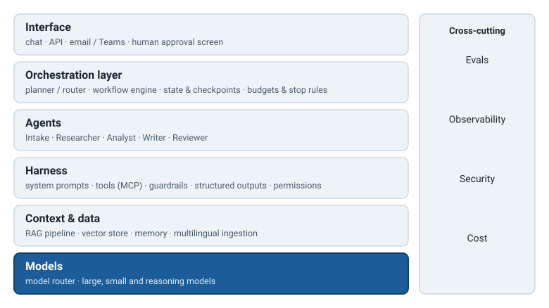

# Class 1 · Foundations: Thinking and Models

<div class="class-meta" markdown><span>AI Engineering</span><span>~3 hours</span><span>Python</span><span>Layer: models</span></div>

!!! abstract "By the end of this class you will be able to"
    - Apply the four habits of **computational thinking** (decomposition, pattern recognition,
      abstraction, algorithms) to an AI system, and label each step **AI**, **deterministic
      code** or **human**.
    - Explain how an LLM produces text: **tokens**, **next-token prediction**, and **sampling**
      with temperature and top-p.
    - Estimate the **token count and cost** of a workload, including the cost differences
      across six widely used languages (Arabic, Chinese, English, French, Russian, Spanish).
    - Describe, at an engineer's level, the **context window**, the **transformer** and
      **attention**, **embeddings** and the **training stages** that make a chat model.
    - Choose between model types (**reasoning** vs standard, **multimodal**, **open-weight** vs
      closed, **small** vs large) for a given step, and account for the **knowledge cutoff**.
    - Design for **non-determinism**: test with fakes, validate outputs, and decide in code what
      happens when two runs disagree.

!!! note "Where we are"
    In the [pre-work](prework.md) you made one model call and saw its reply, token count and
    latency. This class explains what happened inside that call, and gives you the habit of
    thinking that the rest of the course depends on: break the task down, decide what the model
    does, what code does and what a human does, then verify. In [Class 2](c2.md) you put that
    into practice by making the model return structured, validated data.

<div class="diagram" markdown>

</div>

## 1. Computational thinking for AI systems

Imagine the duty officer at a relief coalition's operations desk on a flood morning. Forty
messages arrive: emails from district teams, a forwarded spreadsheet, WhatsApp voice notes, a
government bulletin in French. By 10:00 a situation report (SitRep) must go to partners. A good
duty officer does not read everything and then write from memory. They sort the inbox, pull
figures into a table, check totals, call the district team about the figure that looks wrong,
draft, and have a colleague read it before it goes out.

That is **computational thinking**: solving a problem in a way that a mix of people and
machines can carry out reliably. It has four habits, and each has a specific meaning when one
of the machines is an LLM.

| Habit | General meaning | For an AI system |
|---|---|---|
| **Decomposition** | Break a big task into smaller steps | Split the job until each step is simple enough to give to one owner (a model call, a function or a person) and to check on its own |
| **Pattern recognition** | Notice what steps have in common | Recognise the *kind* of work: reading language, arithmetic, lookup, judgement, approval. The kind decides the owner |
| **Abstraction** | Keep what matters, hide the rest | Define the *interface* of each step: its inputs, its output schema, what "done" means. Hide the model behind it |
| **Algorithms** | Write the steps as an exact procedure | Fix the order, the checks between steps, the retry and stop rules, and what happens on failure |

The mistake this protects you from is the **one big prompt**: "Here are 40 messages, write the
SitRep." It sometimes produces something impressive. You cannot test it, you cannot tell which
figure came from where, and when it silently adds 1,200 households to 1,450 households, you
find out from a partner.

### Who does each step: AI, code or human?

Once the task is decomposed, each step gets exactly one owner. Pattern recognition makes this
mostly mechanical:

| Give it to... | When the step is... | SitRep examples |
|---|---|---|
| **The model (AI)** | Reading or writing natural language; handling messy, varied input; drafting | Extract facts from a free-text email; translate a French bulletin; draft the narrative |
| **Deterministic code** | Arithmetic, counting, sorting, lookup, format checks, moving data: anything with one right answer you can compute | Add up figures per district; check every figure has a source; check the draft has five headings |
| **A human** | Accountability, discretion, local knowledge, anything irreversible or high-stakes | Resolve conflicting figures; approve publication |

Two rules turn this table into a design:

1. **Every AI step is checked by a later code or human step.** The model *proposes*; something
   deterministic or accountable *disposes*.
2. **Nothing leaves the team without a human decision.** Publication, allocation and
   external communication are gated.

The short version, which you will hear all course: **AI proposes, code checks, humans decide.**

### Worked example: decomposing the SitRep

Here is one defensible decomposition of the morning SitRep. It is also the reference answer in
this class's lab, where a validator enforces the two rules above.

| # | Step | Kind | Owner | Checked by |
|---|---|---|---|---|
| 1 | Collect today's reports from the mailbox and shared folder | I/O | Code | — |
| 2 | Make English working copies of reports in French or Arabic | Language | **AI** | Step 7 (a bilingual colleague spot-checks any figure in dispute) |
| 3 | Extract facts (what, where, when, figure *as written*, source) into a fixed schema | Language | **AI** | Step 4 |
| 4 | Validate each fact against the schema; check each figure appears verbatim in its source | Verify | Code | — |
| 5 | Decide whether two reports describe the same incident | Judgement | **AI** | Step 7 |
| 6 | Add up figures per district, keeping households and people separate | Arithmetic | Code | — |
| 7 | Resolve conflicting figures (1,200 vs 1,450 households) | Judgement | **Human** | — |
| 8 | Draft the narrative sections to the template | Language | **AI** | Step 9 |
| 9 | Check headings, word limit, and that every figure in the draft is in the totals table | Verify | Code | — |
| 10 | Duty officer reads and approves | Approval | **Human** | — |
| 11 | Send to the distribution list | I/O | Code | — |

Notice three things:

- **The model owns four of eleven steps**, all of them language work. Most of the system is
  ordinary software. That is normal, and it is good news: ordinary software is testable.
- **Arithmetic belongs to code (step 6).** Models are unreliable at adding up long columns of
  numbers, and it takes one line of Python to do it exactly.
- **Step 5 could have gone either way.** "Same incident?" is judgement. A model can propose
  matches and a human confirms them. If duplicates are rare, a human alone may be cheaper.
  Decomposition makes such choices *visible*, so you can argue about them.

Step 3 of this table is exactly what you build in Class 2. The whole table becomes a
multi-agent pipeline in [Class 6](c6.md).

## 2. Where LLMs sit in the AI family

"AI" covers many techniques. The one this course builds with is the **large language model**
(LLM), a neural network trained on a very large amount of text to predict what comes next. It
sits at the innermost of a set of nested ideas: AI ⊃ machine learning ⊃ deep learning ⊃
generative AI. The sidebars give the short version; the [AI Literacy Class 1](../literacy/c1.md)
tells the longer story.

--8<-- "shared/sidebars/ai-family-tree.md"

--8<-- "shared/sidebars/neural-networks.md"

--8<-- "shared/sidebars/ai-timeline.md"

For an engineer, the practical point of the history is this: before about 2020, a new language
task (classify these messages, extract these fields) meant collecting labelled data and training
a model for that one task. With LLMs, one general model does thousands of tasks, and you
*describe* the task in a prompt. That moves the work from training models to designing prompts,
interfaces, checks and pipelines. That work is this course.

## 3. Tokens: what the model actually reads

A model does not see letters or words. It sees **tokens**: chunks of text, each mapped to an
integer ID from a fixed vocabulary of typically 100,000–200,000 entries. A **tokenizer** splits
your text into tokens before the model sees it, and turns the model's output tokens back into
text.

--8<-- "shared/sidebars/tokens.md"

Tokenizers are built with an algorithm such as **byte-pair encoding (BPE)**: start with single
characters (or bytes), then repeatedly merge the most frequent adjacent pair into a new token,
over a huge sample of text. Frequent words become one token; rare words are built from pieces.
In a typical English tokenizer:

```text
"Clean water is the most urgent need."   ->  Clean | water | is | the | most | urgent | need | .
"households displaced"                   ->  households | displaced         (common: 1 token each)
"Aramu"                                  ->  Ar | amu                        (rare name: pieces)
"1,450"                                  ->  1 | , | 450                     (numbers: split)
```

Leading spaces are usually part of the token (`" water"`, not `"water"`). As a rule of thumb, one
token is about **four characters or three-quarters of a word of English**.

### Why engineers care about tokens

- **Cost.** Providers bill per token: input tokens (everything you send) and output tokens
  (everything the model writes) at different prices. Output usually costs several times more.
- **Limits.** The context window (Section 5) and the maximum output length are measured in
  tokens, not words or pages.
- **Latency.** The model generates output one token at a time, so a 600-token reply takes
  roughly six times as long as a 100-token one.
- **Odd failures.** The model does not see letters, so tasks like "count the letters" or
  "reverse this word" are hard for it. Numbers are split into chunks, which is one reason
  models are unreliable at arithmetic, and one more reason step 6 above belongs to code.

### Six languages, six different costs

Tokenizers learn their vocabulary from their training text, which has historically been mostly
English. Common English words become single tokens, while words in scripts that were less
frequent in that text are split into more, shorter pieces. The *same message* therefore costs
more tokens, and more money, in some languages.

The lab's approximate tokenizer gives these counts for one fictional sentence ("Flooding in
Aramu district has displaced about 1,200 households. Clean water is the most urgent need."):

| Language | Approx. tokens | vs English |
|---|---|---|
| English | 24 | 1.00× |
| French | 32 | 1.33× |
| Spanish | 32 | 1.33× |
| Arabic | 33 | 1.38× |
| Chinese | 34 | 1.42× |
| Russian | 43 | 1.79× |

These are *approximations* from a deliberately simple tokenizer. Real ratios depend on the
tokenizer: newer tokenizers (as of 2026) have much larger multilingual vocabularies and have
narrowed the gap, but it has not disappeared. **Measure with your model's own tokenizer** before
budgeting a multilingual service. In the lab you plug in a real one with a single argument.

What it means in practice:

- A SitRep service that processes Arabic and Russian reports can cost noticeably more per
  report than the same service in English, and it fills the context window sooner.
- **Translating everything into English first** is not automatically cheaper: you pay for the
  translation call, and you risk losing meaning. Measure both routes.
- **Fairness matters.** If the per-user budget is set by English usage, colleagues working in
  other languages hit limits first.

### Estimating cost

The arithmetic is simple, and worth doing before you build anything:

```text
cost per call  = input_tokens  × input_price_per_token
               + output_tokens × output_price_per_token

monthly cost   = cost per call × calls per day × days
```

For example, with *illustrative* "large model" prices of USD 3 per million input tokens and
USD 15 per million output tokens, a call that sends a 1,000-token report and gets back a
600-token draft costs about USD 0.012. At 300 reports a day that is roughly USD 110 a month for
this one step. A multi-agent pipeline with five calls per report and a review loop multiplies it.
The lab's `tokens.py` does this calculation with a pluggable tokenizer:

```python
from tokens import EXAMPLE_PRICES, estimate_cost

one = estimate_cost(report_text, expected_output_tokens=600, price=EXAMPLE_PRICES["large"])
print(one.input_tokens, one.cost_usd, one.times(300 * 30).cost_usd)
```

## 4. Next-token prediction and sampling

At its core, an LLM does one thing: given a sequence of tokens, it outputs a **probability for
every token in its vocabulary** being the next one. To write a reply, the system picks one token,
appends it to the sequence, and asks again, one token at a time until a stop token or a length
limit. This is **next-token prediction**, and the one-at-a-time process is called
**autoregressive generation**.

Suppose the text so far is *"In the Aramu school shelter, the most urgent need is clean"*. The
model's output might look like this (made-up numbers):

| Candidate next token | Probability |
|---|---|
| `" water"` | 0.82 |
| `" drinking"` | 0.07 |
| `" sanitation"` | 0.04 |
| `" toilets"` | 0.02 |
| `" clothes"` | 0.01 |
| ...100,000+ others | 0.04 in total |

Everything the model "knows" (grammar, facts, the style of a SitRep) shows up only as the
shape of these distributions. The model has no separate store of facts that it looks things up
in. That is why a fluent, plausible and wrong continuation is always possible: the model is
built to produce *likely* text, and likely is not the same as true. A model inventing a figure
or a source is called **hallucination**.

### Sampling: temperature and top-p

Choosing a token from the distribution is called **sampling**, and you control it with two
main settings:

- **Temperature** reshapes the distribution before sampling. At **0** the system (nearly)
  always takes the most likely token, so output is focused and repetitive. At **1** it samples
  from the distribution as the model produced it. Above 1 the unlikely tokens get boosted and
  output becomes more varied, and eventually incoherent.
- **Top-p** (nucleus sampling) keeps only the smallest set of top tokens whose probabilities add
  up to *p*, and samples among those. With top-p 0.9 in the table above, `" water"` and
  `" drinking"` add up to 0.89, just short, so `" sanitation"` joins them (0.93) and those
  three are the only candidates. The long tail of odd tokens is cut off.

Change one of the two at a time, not both. Starting points:

| Task | Temperature | Why |
|---|---|---|
| Extraction, classification, structured output | 0–0.2 | You want the most likely reading of the source, every time |
| Summaries, SitRep drafting | 0.2–0.7 | Some fluency; facts come from the source, not from creativity |
| Brainstorming, alternative headlines | 0.8–1.0 | Variety is the point |

With LiteLLM, sampling settings are ordinary keyword arguments:

```python
import litellm

response = litellm.completion(
    model="openai/gpt-4o-mini",
    messages=[{"role": "user", "content": "Suggest three headlines for this SitRep: ..."}],
    temperature=0.9,
    max_tokens=200,          # an upper bound on output tokens: a cost and latency control
)
```

!!! warning "Reasoning models and sampling (as of 2026)"
    Some reasoning models ignore or reject `temperature` and `top_p`, or accept only their
    defaults, and expose a "reasoning effort" setting instead. Check your model's documentation.
    Your design must not depend on temperature 0 for correctness anyway (Section 9).

## 5. The context window

The **context window** is the maximum number of tokens the model can take into account in one
call: your system prompt, the conversation history, any documents you include, **and the output
it generates**. As of 2026, common limits run from about 128,000 tokens to a million or more,
depending on the model.

Four facts about the context window shape almost every design decision in this course:

1. **The model is stateless.** It remembers nothing between calls. A chat "remembers" because
   the application resends the whole conversation every turn. Your SitRep pipeline must decide,
   for every call, what goes in.
2. **You pay for everything you send, every time.** A 50-page document in the context costs its
   tokens on every call that includes it. Provider features such as **prompt caching** reduce
   the cost of a repeated prefix (Class 4).
3. **Bigger is not the same as better.** Models attend less reliably to information buried in
   the middle of very long contexts (the "lost in the middle" effect), and irrelevant material
   distracts them. A focused 5,000-token context often beats an unfocused 200,000-token one.
4. **The window is shared with the output.** If the input nearly fills the window, the reply is
   cut short.

Deciding what goes into the window, what gets retrieved, summarised or left out, is **context
engineering**, and it is the subject of [Class 4](c4.md).

## 6. Inside the model: transformers, attention and embeddings

You do not need the mathematics to build good systems. You do need a working mental model of
three ideas, because they explain the behaviour you will debug.

### The transformer and attention

Almost every modern LLM is a **transformer**. Text passes through dozens of identical layers.
In each layer, **attention** lets every token look at every earlier token and decide how much
each matters for its own meaning. In *"The health post in Tamsi is non-functional; staff moved
its medicines to the school"*, attention links *"its"* to *"health post"*. Stacked over many
layers, this lets the model build up grammar, reference, topic and tone.

--8<-- "shared/sidebars/transformer.md"

Two engineering consequences:

- **Attention costs grow with context length.** Each token looks at all earlier tokens, so long
  prompts are slower and more expensive to process, and the context window has a limit.
- **Order and placement matter.** Instructions at the start (system prompt) or the very end of
  a long context tend to be followed more reliably than instructions buried in the middle.
  Class 2 builds on this.

### Embeddings

Inside the model, every token becomes an **embedding**: a list of numbers (a vector, often with
a few thousand dimensions) that places it in a "meaning space" where related things sit close
together. Separate **embedding models** do the same for whole sentences or paragraphs. They take
text in and return one vector.

--8<-- "shared/sidebars/embeddings.md"

Embeddings are how a system finds text *by meaning* instead of by keyword. "Families sleeping in
the mosque" and "displaced households in a religious building" share almost no words but have
similar embeddings. Closeness is usually measured with **cosine similarity**, which is 1.0 for
vectors pointing the same way and 0 for unrelated ones:

```python
import math

def cosine(a, b):
    dot = sum(x * y for x, y in zip(a, b))
    return dot / (math.sqrt(sum(x * x for x in a)) * math.sqrt(sum(y * y for y in b)))

# Toy 3-dimensional "embeddings" (real ones have hundreds or thousands of dimensions):
shelter_mosque = [0.9, 0.1, 0.3]
displaced_church = [0.8, 0.2, 0.35]
cholera_alert = [0.1, 0.9, 0.2]
print(cosine(shelter_mosque, displaced_church))   # ~0.99: similar meaning
print(cosine(shelter_mosque, cholera_alert))      # ~0.27: different topic
```

This is the foundation of retrieval-augmented generation (RAG) in [Class 4](c4.md). Good
multilingual embedding models place the same meaning close together across languages, so a
French query can find an Arabic report.

## 7. How a chat model is made: training stages

A chat model is built in stages, and each stage explains a behaviour you will see.

1. **Pre-training.** The model learns next-token prediction on a very large body of text (web
   pages, books, code), measured in trillions of tokens. The result, a **base model**, is a
   powerful text continuer but not an assistant. Ask it a question and it may continue with
   more questions.
2. **Fine-tuning (supervised).** The base model is trained further on curated examples of
   instructions and good responses. Now it follows instructions and answers in a helpful format.
3. **Preference training.** People (and increasingly AI graders) compare responses, and the
   model is trained to prefer the better ones. This is known as **RLHF** (reinforcement learning
   from human feedback) and related methods. This stage shapes tone, helpfulness, refusals and
   safety behaviour. Reasoning models get an extra stage of reinforcement learning on problems
   with checkable answers.

--8<-- "shared/sidebars/training-stages.md"

What follows from this:

- **Knowledge is frozen at the knowledge cutoff.** Pre-training data stops at a date. The model
  knows nothing after it unless you put it in the context, and it may not know *that* it does
  not know.
- **Helpfulness is trained, and it has side effects.** Preference training rewards answers that
  people liked, and people like confident, complete answers. That is one reason models guess
  instead of saying "not stated", and why your prompts and validators must make "not stated"
  an acceptable answer (Class 2).
- **You rarely need to train.** Fine-tuning your own model is sometimes worthwhile (Class 8
  covers when). For almost everything in this course, prompts, context and code give you more
  control for far less cost.

--8<-- "shared/sidebars/knowledge-cutoff.md"

## 8. Choosing a model: the main types

"Which model?" is a design decision you will make per step, not once per project. Four
distinctions cover most of it.

### Reasoning models vs standard models

**Reasoning models** generate a hidden (or summarised) chain of intermediate reasoning before
answering, spending extra "thinking" tokens. They are much better at multi-step problems:
reconciling figures across reports, planning, checking constraints, writing code. They are
slower and cost more per answer, because thinking tokens are billed as output. As of 2026, most
major providers offer reasoning models or a reasoning mode with an adjustable effort setting.

--8<-- "shared/sidebars/reasoning-models.md"

Use them for steps that need judgement across several facts (the Analyst, the planner). Do not
use them for simple extraction or classification, where a standard model is faster, cheaper and
just as accurate.

### Multimodal models

**Multimodal** models accept (and some produce) more than text: images, scanned PDFs, audio,
sometimes video. For field work that matters: a photo of a handwritten distribution list, a
scanned government bulletin, a voice note from a volunteer.

--8<-- "shared/sidebars/multimodal.md"

Treat a multimodal step like any other AI step: its output (the transcription, the extracted
table) is a proposal, and a code or human check follows. Images and audio also cost tokens,
often many.

### Open-weight vs closed models

**Closed** models (from providers such as OpenAI, Anthropic or Google) are used only through
the provider's API or a cloud platform such as Azure. **Open-weight** models (as of 2026,
families such as Llama, Mistral, Qwen, DeepSeek, Gemma and gpt-oss) publish their trained
weights, so you can run them on your own servers.

--8<-- "shared/sidebars/open-vs-closed.md"

For most organisations the trade-off is mostly about **data control versus capability and effort**.
Open weights let sensitive data stay on infrastructure you control and remove dependence on one
vendor. You then run, secure, scale and update the model yourself. Closed frontier models are
typically the most capable and need no infrastructure, but your data goes to the provider under
the terms of your agreement. LiteLLM talks to both, so the lab code does not change.

### Small vs large models

Larger models are generally more capable and more knowledgeable, and they are slower and more
expensive per token, often by 10–20 times. Small models are fast and cheap, and for narrow,
well-specified tasks (classification, extraction with a schema, routing) they are often good
enough, especially with a validator behind them.

--8<-- "shared/sidebars/small-vs-large.md"

A practical selection table for the SitRep pipeline (tiers, not product names, which change
every few months):

| Step | Model choice | Why |
|---|---|---|
| Classify incoming messages | Small, standard | Short input, few labels, high volume |
| Extract facts into a schema | Small or mid, standard | Mechanical; validation catches errors |
| Transcribe a photo of a handwritten list | Multimodal | Input is an image |
| Reconcile conflicting figures, plan | Large or reasoning | Multi-step judgement |
| Draft the narrative | Mid, standard | Fluent writing to a template |
| Anything with sensitive data your agreement does not cover | Open-weight, self-hosted, or don't use AI | Data control comes first |

Start with the cheapest model that passes your tests, and move up only when a measured failure
justifies it. Class 6 turns this into **model routing** and **cascades**, and Class 7 gives you
the tests to measure with.

## 9. Non-determinism and what to do about it

Send the same prompt twice and you may get two different answers. This is **non-determinism**,
and it has three sources:

1. **Sampling.** With temperature above 0, randomness is the design.
2. **Temperature 0 is not a guarantee.** Providers run models on shared hardware in batches, and
   tiny floating-point differences can change which token wins a near-tie. After one different
   token, the rest of the reply can diverge.
3. **Models change.** A model name without a version (an "alias") may point to a newer model
   next month. Providers also retire models.

The first question is not "how do I make it deterministic?" but "what does my system do when two
runs disagree?". The engineering consequences are the backbone of this course:

| Consequence | What to do | Where in the course |
|---|---|---|
| You cannot unit-test the model's exact words | Put the model behind an interface and test **your** code with a scripted `FakeLLM` | Every lab |
| Output shape can vary | Parse and **validate** every output against a schema; retry with the error | Class 2 |
| Answers can disagree | For short, high-stakes answers, **sample several times and vote**; escalate to a human when agreement is low | This lab |
| Quality is a distribution, not a single run | Evaluate on a **test set** of many cases, and compare versions statistically | Class 7 |
| Models change underneath you | **Pin model versions** where the provider allows; re-run evals before upgrading | Classes 7–8 |
| You need to explain a past output | **Log** prompt version, model version, inputs, outputs and settings for every call | Class 7 |

The lab's `variance.py` shows the voting pattern (often called **self-consistency**). It asks
the same question N times, normalises the answers ("1,200 households." and "1200" are the same
answer), and accepts the majority only if enough samples agree:

```python
def majority_answer(replies, min_agreement=0.7, normalize=normalize_number):
    report = analyse(replies, normalize)
    return report.majority if report.agreement >= min_agreement else None   # None -> human
```

Run it on the fictional Kessan reports, where one report says 1,200 households and another says
1,450, and the disagreement between samples becomes *information*: it points you at a
genuine conflict in the source data that a human must resolve. Voting costs N calls, so use it
for short answers that matter, not for drafting whole reports.

## Prompt Lab

Use your approved chat tool or the lab's `llm.py`. Compare results with your pair.

### Exercise 1: Decomposition partner

**Task:** use the model to decompose a process, then critique its answer against this class's
two rules. Run it on the SitRep first, then on a process from your own work.

```text
I am designing a system that turns daily field reports from district teams into a
situation report (SitRep) for humanitarian partners.

Decompose the process into 8-12 steps. For each step give:
- a one-line description
- the kind of work: io, language, judgement, arithmetic, verify, approval or publish
- the owner: AI (a language model), code (deterministic software) or human
- for every AI step, which later step checks its output

Rules: arithmetic and format checks must be code; approval must be a human; every AI
step must be checked by a later code or human step; nothing is published before a
human approves it.

Return a markdown table, then list the two steps whose owner you are least sure about
and why.
```

**What to look for:**

- Does the model give arithmetic to itself? Does it put a check after every AI step, or
  quietly drop the rule?
- Are its "least sure" steps the same ones your pair argued about?
- Paste its table into `MY_DECOMPOSITION` in the lab and run the validator. Did the model
  follow rules it was given in the same prompt?

### Exercise 2: Same prompt, five answers

**Task:** see non-determinism directly. Send this prompt five times, in five **new** chats (or
five calls), and record each answer. If you can set temperature, repeat at 0 and at 1.

```text
Read these two reports and reply with a single number only: how many households are
affected in total?

Report 1 (14 March): approx 1,200 households affected in Tamsi and Lower Tamsi.
Report 2 (15 March): We count 1,450 households affected across Tamsi, Lower Tamsi
and Bara.
```

**What to look for:**

- How many different answers did you get: 1,200, 1,450, 2,650 or something else? The
  correct answer is not a single number, because the reports overlap.
- Did temperature 0 make the answers identical? Did it make them *right*?
- Rewrite the prompt so the honest answer is possible (for example, allow "conflict:
  1,200–1,450, reports overlap"). How does that change the variance?

### Exercise 3: Probing the knowledge cutoff

**Task:** find the edge of the model's knowledge, and see how it behaves there.

```text
1. What is your knowledge cutoff date?
2. Name three significant developments in AI model releases in the six months before
   your cutoff, with dates.
3. What happened in AI in the month after your cutoff? If you do not know, say so
   explicitly rather than guessing.
4. For each answer above, rate your confidence (high / medium / low) and explain why.
```

**What to look for:**

- Does the stated cutoff match the provider's documentation (look it up)?
- In question 3, does it say it does not know, or produce plausible "news"? What does that
  tell you about asking a model for facts that change, such as funding figures, contacts or
  policies?
- If your tool has web search switched on, the answer changes completely. Which parts came
  from the model and which from search? How would a user tell?

## Lab: Thinking and models in code

**Goal:** turn the class's three big ideas into small tested tools: a token and cost estimator,
a checked decomposition of the SitRep process, and a variance experiment. Every test runs
**without an API key**.

The code is in `labs/engineering/c1/`:

| File | Role |
|---|---|
| `llm.py` | `LLM = Callable[[List[Dict[str, str]]], str]` and a LiteLLM adapter |
| `tokens.py` | Pluggable tokenizer, cost estimator, six-language comparison |
| `decomposition.py` | The decomposition exercise and its validator |
| `variance.py` | Sample N times, normalise, vote or escalate |
| `test_c1.py` | 20 tests with a pure-Python tokenizer and a scripted `FakeLLM` |
| `sample_reports.md` | Three fictional Kessan reports with a deliberate conflict |

### Step 1 · Set up and run the tests (10 min)

```bash
cd labs/engineering/c1
source ../prework/.venv/bin/activate     # or create a new venv as in the pre-work
pytest -q
```

All 20 tests should pass without a key.

### Step 2 · Tokens and cost (15 min)

```bash
python tokens.py
```

The tokenizer is **pluggable**: any function `text -> list of token strings` works.

```python
Tokenizer = Callable[[str], List[str]]

def count_tokens(text: str, tokenizer: Tokenizer = approx_tokenize) -> int:
    return len(tokenizer(text))
```

`approx_tokenize` is a pure-Python stand-in so the tests need no packages. It splits by script
with a rough characters-per-token rate for each. With `pip install tiktoken` you can plug in a
real tokenizer: `language_table(LANGUAGE_SAMPLE, tokenizer=tiktoken_tokenizer())`.

**Try it:** with the "small" and "large" example prices, what does the SitRep extraction step
cost per month at 300 reports a day if half the reports are in Arabic? What if every report is
translated into English first (one extra call per report)?

### Step 3 · Decompose the SitRep (20 min)

Open `decomposition.py`. `MY_DECOMPOSITION` lists eleven steps, each with a `kind` but with
`owner="?"`. Fill in each owner and, for AI steps, `checked_by`, then run:

```bash
python decomposition.py
```

The validator enforces the rules from Section 1:

```python
if t.kind == "arithmetic" and t.owner != "code":
    problems.append(f"{t.id}: arithmetic belongs to code (deterministic and testable)")
if t.owner == "AI":
    ...  # checked_by must name a LATER step owned by code or a human
if t.kind == "publish" and not human_approval_seen:
    problems.append(f"{t.id}: nothing is published before a human approval step")
```

When it passes, compare with `REFERENCE_DECOMPOSITION`. Where you differ, is either answer
wrong, or are both defensible? Add one step of your own (for example "detect personal data
before sending text to the model") and decide its kind and owner.

### Step 4 · Variance handling with FakeLLM (10 min)

Read the variance tests in `test_c1.py`. The `FakeLLM` returns a scripted list of different
answers, as a real model might across N samples:

```python
llm = FakeLLM(["1200", "1,200", "1450"])
replies = sample(llm, messages, n=3)
```

`analyse()` normalises and counts them; `majority_answer()` returns the majority only at 70%
agreement or more, otherwise `None`, meaning "send to a human".

**Try it:** write a test where eight replies say 1,200 and two are unparseable ("I cannot tell").
Should unparseable replies count against agreement? Decide, write the test, make it pass.

### Step 5 · Run it for real (5 min)

```bash
export MODEL=openai/gpt-4o-mini          # or azure/<deployment>, anthropic/<model>
python variance.py
```

Compare the spread at temperature 0 and 1.0. With your pair: did temperature 0 give one answer?
Was the majority answer *correct*, given that the reports overlap? What should the SitRep
say about this figure?

### Stretch challenges

1. **Real tokenizer ratios.** Install `tiktoken`, compare two encodings across the six
   languages, and tune `CHARS_PER_TOKEN` to within 15% of the real counts.
2. **A better normaliser.** Make "Between 1,200 and 1,450" count as unparseable (or as a
   range), with tests.
3. **Budget guard.** Write `check_budget(prompt, max_input_tokens)` that refuses a call before
   it is made, and decide where in the decomposition it belongs.

## Check Your Understanding

<!-- quiz: engineering/c1 -->

## Exit Ticket

!!! question "Before you leave"
    Take one process from your own work that you might automate with AI. Write down (1) its
    steps, each labelled AI, code or human; (2) the one AI step whose output you would find
    hardest to check, and how you would check it anyway; (3) which step you would *never* give
    to a model, and why.

## Key terms

- **Computational thinking:** decomposition, pattern recognition, abstraction and algorithms,
  applied so people and machines can carry out a task reliably.
- **AI / code / human split:** giving each step one owner; AI proposes, code checks, humans
  decide.
- **Large language model (LLM):** a neural network trained on very large amounts of text to
  predict the next token.
- **Token, tokenizer, byte-pair encoding (BPE):** the chunks of text a model reads, the tool
  that splits text into them, and a common algorithm for building its vocabulary.
- **Next-token prediction, autoregressive generation:** producing a probability for every
  possible next token, and generating text one token at a time.
- **Sampling, temperature, top-p:** choosing the next token from the distribution; flattening
  or sharpening it; keeping only the most probable tokens that add up to *p*.
- **Hallucination:** fluent output that is not supported by the source or by fact.
- **Context window:** the maximum number of tokens (input plus output) a model can use in one
  call.
- **Transformer, attention:** the architecture of modern LLMs, and its mechanism for weighing
  how much each token matters to every other.
- **Embedding, cosine similarity:** a vector that represents meaning, and a measure of how close
  two such vectors are.
- **Pre-training, fine-tuning, RLHF:** the training stages that turn a text predictor into an
  assistant.
- **Knowledge cutoff:** the date after which the model's training data stops.
- **Reasoning model, multimodal model, open-weight model, small vs large model:** the main model
  types to choose between.
- **Non-determinism, self-consistency:** different outputs for the same input, and voting across
  several samples to handle it.

<div class="complete-toggle"></div>
