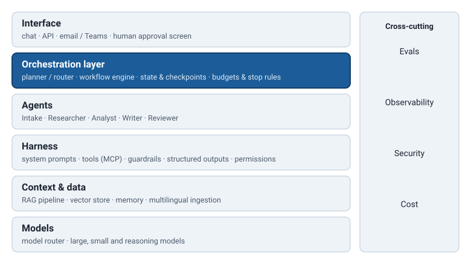

# Class 6 · Agents & Orchestration

<div class="class-meta" markdown><span>AI Engineering</span><span>~3 hours</span><span>Python</span><span>Layer: orchestration + agents</span></div>

!!! abstract "By the end of this class you will be able to"
    - Explain the **agent loop** (observe → think → act → repeat) and implement a bounded version of it in Python.
    - Decide, with explicit criteria, when a **workflow** beats an **agent** — and justify the choice to a reviewer.
    - Recognise and apply the **six orchestration patterns**: prompt chaining, routing, parallelization, orchestrator-workers, evaluator-optimizer and the autonomous agent.
    - Compare **multi-agent topologies** (single agent, supervisor, hierarchical, handoffs) by their coordination cost and failure modes.
    - Design an **orchestration layer** with validated plans, state, checkpoints, budgets, stop rules and human approval gates.
    - Build a framework-free multi-agent SitRep pipeline, then map it onto **LangGraph** and the wider framework landscape.

!!! note "Where we are"
    In Classes 2–5 you built everything *inside* a single model call: a structured prompt, a
    tested app, retrieval with citations, and a harness with tools and guardrails. Today we move
    one layer up. The **orchestration layer** decides *which* calls happen, *in what order*,
    *with what information*, and *when to stop*. The **agents** layer is the set of specialists
    it coordinates. By the end of the lab, the SitRep Assistant is no longer one prompt — it is a
    small team with a coordinator.

<div class="diagram" markdown>

</div>

## 1. From one call to an agent

Everything so far has had the same shape: you send messages, the model sends text back, your
code decides what to do next. In Class 5 you gave the model **tools** — but you still decided,
in code, how many times it could call them. An **agent** removes that last piece of fixed
control flow: the model itself decides, turn by turn, whether to call another tool or to stop.

The agent loop has four beats:

1. **Observe** — read the goal plus everything that has happened so far (previous tool results,
   errors, human messages).
2. **Think** — decide the next move. With modern models this is often an explicit reasoning
   step; at minimum it is the choice of which tool to call with which arguments.
3. **Act** — call the tool. Your code executes it, not the model.
4. **Repeat** — append the result to the conversation and go back to *observe*, until the model
   says it is done, a **stop rule** fires, or a human intervenes.

Here is the whole thing in about twenty lines. It is pseudo-code — the exact shape of
`reply.tool_calls` differs by SDK — but every agent framework you will meet is an elaboration of
this loop.

```python
def agent_loop(llm, tools, goal, max_steps=10):
    messages = [{"role": "system", "content": AGENT_PROMPT},
                {"role": "user", "content": goal}]
    for step in range(max_steps):                   # BUDGET: a hard stop owned by code
        reply = llm(messages, tools=tool_schemas(tools))   # THINK: model picks next move
        messages.append(reply.as_message())
        if not reply.tool_calls:                    # model says "done"
            return reply.text
        for call in reply.tool_calls:               # ACT: our code runs the tool
            try:
                result = tools[call.name](**call.arguments)
            except Exception as exc:
                result = f"ERROR: {exc}"            # errors are observations too
            messages.append({"role": "tool",        # OBSERVE: result goes back in
                             "tool_call_id": call.id,
                             "content": str(result)})
    raise BudgetExceeded(f"no final answer after {max_steps} steps")
```

Three lines in that loop deserve your attention, because they are where production agents
succeed or fail:

- **`for step in range(max_steps)`** — the model does *not* reliably stop on its own. It may
  keep searching "just one more time", or oscillate between two tools. The budget is enforced
  in code, not requested in the prompt.
- **`except Exception`** — a tool error is fed back as an observation, so the model can recover
  (retry with different arguments, try another tool). Crashing the loop on the first 404 wastes
  everything done so far; silently swallowing the error hides it from the model.
- **`raise BudgetExceeded`** — running out of budget is a *distinct outcome*, not a success.
  Downstream code (and a human) must be able to tell "finished" from "gave up".

--8<-- "shared/sidebars/agents.md"

### ReAct: reasoning interleaved with acting

The loop above is usually called **ReAct** (Reason + Act), after a 2022 paper that showed models
perform better on multi-step tasks when they alternate short reasoning with real actions,
rather than planning everything up front or acting without reasoning. A ReAct trace for a
SitRep question looks like this:

```text
Thought:     The user wants displacement figures for Kessan district since 11 March.
             I should search the field reports.
Action:      search_reports(query="Kessan displacement", since="2026-03-11")
Observation: 3 reports. R1: ~400 people in Kessan primary school. R3: ~60 families in
             Bara mosque and church.
Thought:     R3 uses families, R1 uses people. I must not add them. I'll report both
             and flag the unit mismatch.
Action:      (none — final answer)
```

The value is not only accuracy. The trace is an audit record: when the figure in a SitRep is
wrong, you can find the exact observation it came from, or discover that it came from no
observation at all.

--8<-- "shared/sidebars/react.md"

## 2. Workflows vs agents

There are two ways to connect several model calls:

- A **workflow** is a system where *your code* defines the path: step A, then B, then C, maybe
  a branch. The model fills in each step, but it does not choose the steps.
- An **agent** is a system where *the model* chooses the path at run time, inside the limits you
  set.

Autonomy is a cost, not a feature. Every decision you hand to the model is a decision you can no
longer unit-test, predict the cost of, or explain in a single sentence to an auditor. The
question is never "can an agent do this?" — it usually can, some of the time — but "does the
task *need* the model to choose the path?"

| Question | Points to a **workflow** | Points to an **agent** |
|---|---|---|
| Can you write the steps down in advance? | Yes, and they rarely change | No — steps depend on what is found along the way |
| How many distinct paths are there? | A handful you can enumerate | Open-ended |
| Cost of a wrong action | High (sending, publishing, spending) | Low or reversible (reading, drafting) |
| Need for predictable cost and latency | Strict (SLA, fixed budget) | Flexible |
| Auditability requirement | Must explain every step | Trace review is enough |
| Example in the SitRep | Extract → analyse → write → review, every day | "Investigate why the Bara figures disagree across three weeks of reports" |

A useful rule of thumb: **start with the simplest thing — one well-built call — and add
orchestration only when you can name the failure it fixes.** Most production "agent" systems
turn out, on inspection, to be workflows with one or two agentic steps inside them. That is not
a compromise; it is good engineering.

## 3. The six patterns

The patterns below, popularised by Anthropic's *Building Effective Agents* (2024), cover almost
every orchestration design you will encounter. The first five are workflows; the sixth is a
true agent. Real systems combine them.

### 3.1 Prompt chaining

```text
input ──► [ LLM: extract ] ──► gate? ──► [ LLM: analyse ] ──► [ LLM: write ] ──► output
                                 │
                                 └─ fail ──► stop / fix
```

Split a task into fixed sequential steps; each step's output is the next step's input. Put a
**gate** — a programmatic check — between steps where you can.

- **Use when** the task decomposes cleanly into steps that are each easier than the whole, and
  the order never changes.
- **Don't use when** steps are independent (use parallelization) or the order depends on content
  (use routing or an agent).
- **SitRep example:** Researcher extracts facts → a code gate checks every fact has a location and
  a source → Analyst computes totals → Writer drafts. The gate catches "facts" with no source
  before they become figures in a published report.

### 3.2 Routing

```text
                    ┌──► [ SitRep pipeline ]
input ──► [ router ]├──► [ Update-existing-SitRep pipeline ]
                    ├──► [ Translation pipeline ]
                    └──► out_of_scope ──► polite refusal
```

A first call **classifies** the input and sends it to a specialised downstream path, each with
its own prompt, tools and possibly model.

- **Use when** inputs fall into distinct categories that are better handled separately, and
  classification is reliable (measure it — Class 7).
- **Don't use when** the categories overlap heavily, or one general prompt handles all of them
  well. A router that misroutes 10% of requests adds a new failure mode.
- **SitRep example:** a request "update yesterday's SitRep with the health office email" goes to a
  diff-and-merge pipeline rather than a from-scratch pipeline; "book me a flight" is refused
  before it costs anything.

### 3.3 Parallelization: sectioning and voting

```text
Sectioning:                               Voting:
          ┌─► [ LLM: health ]  ─┐                    ┌─► [ LLM: is this a duplicate? ] ─┐
input ────┼─► [ LLM: shelter ] ─┼─► merge   input ───┼─► [ LLM: is this a duplicate? ] ─┼─► majority
          └─► [ LLM: WASH ]    ─┘                    └─► [ LLM: is this a duplicate? ] ─┘
```

Run several calls at the same time. **Sectioning** gives each call a different sub-task;
**voting** gives several calls the same task and aggregates their answers.

- **Use when** sub-tasks are genuinely independent (sectioning) or you need higher confidence on
  a judgement call (voting). Parallel calls also cut wall-clock time.
- **Don't use when** the parts depend on each other, or the merge step is harder than the task
  itself. Voting multiplies cost; use it for high-stakes, short decisions.
- **SitRep example:** health, shelter and water/sanitation (WASH) sections drafted in parallel from
  the same facts; three votes on "are these two reports describing the same incident?" before
  de-duplicating casualty counts.

### 3.4 Orchestrator-workers

```text
                                  ┌─► [ worker: Researcher ] ─┐
request ──► [ orchestrator: plan ]┼─► [ worker: Analyst ]    ─┼─► [ synthesise ] ──► output
                                  └─► [ worker: ...     ]    ─┘
            (which workers, and how many, is decided at run time)
```

A central model **plans** the sub-tasks at run time, delegates each to a worker, and synthesises
the results. It differs from parallelization in one crucial way: the sub-tasks are *not known in
advance*.

- **Use when** the decomposition depends on the input — for example, which districts, sectors or
  sources need attention differs every day.
- **Don't use when** the plan would be the same every time; then hard-code it as a chain and save
  a call and a failure mode.
- **SitRep example:** today's reports cover flooding in two districts plus a cholera alert; the
  orchestrator plans a Researcher step per district, an Analyst step that depends on both, and
  a Writer step. This is the pattern you build in the lab — with the plan **validated in code**
  before anything runs.

### 3.5 Evaluator-optimizer

```text
task ──► [ generator ] ──► draft ──► [ evaluator ] ──► APPROVED ──► output
               ▲                           │
               └──── numbered fixes ◄──────┘   (max N rounds)
```

One call produces, another critiques against explicit criteria, and the loop repeats until the
evaluator approves or a round budget runs out.

- **Use when** you have clear, checkable evaluation criteria, and a first draft demonstrably
  improves with feedback (it does for writing against a template; less so for pure fact
  lookup).
- **Don't use when** the criteria are vague ("make it better") — the loop will wander — or when
  a deterministic check (word count, required headings) would do. Use code for what code can
  check.
- **SitRep example:** Writer drafts, Reviewer checks five rubric items (headings, traceable
  figures, conflicts flagged, neutral tone, ≤ 400 words) and replies `APPROVED` or a numbered
  list of fixes. Budget: three rounds, then a human looks.

### 3.6 Autonomous agent

```text
goal ──► ┌──────────────────────────────────┐
         │ observe ─► think ─► act (tool) ─┐│ ──► stop rule / done / human ──► output
         │    ▲                            ││
         │    └────────── observation ◄────┘│
         └──────────────────────────────────┘
```

The model runs the loop from Section 1, choosing tools and steps until done.

- **Use when** the path genuinely cannot be predicted, the environment gives reliable feedback
  (tool results, test outcomes), and actions are cheap or reversible.
- **Don't use when** a workflow would do, when actions are irreversible without approval, or when
  you cannot afford unpredictable cost.
- **SitRep example:** "Why do the Bara displacement figures jump from 60 families to 900 people
  between week 2 and week 3?" The agent searches reports, compares units, checks whether a
  camp was merged into the count, and returns an explanation with citations. Read-only tools,
  a 15-step budget, and no ability to edit the published SitRep.

## 4. Multi-agent topologies

Once you have more than one agent, you must decide how they are wired together. Four
topologies cover most designs.

```text
Single agent + tools     Supervisor               Hierarchical                 Handoffs (swarm)
                                                                                   
   [ agent ]              [ supervisor ]           [ top supervisor ]         [ A ] ──► [ B ]
   / | \                   /    |    \              /             \             ▲         │
 t1  t2  t3             [A]    [B]    [C]    [ sup: data ]   [ sup: writing ]   └── [ C ] ◄┘
                                               /     \          /     \
                                            [A]     [B]      [C]     [D]
```

| Topology | How it works | Strengths | Weaknesses |
|---|---|---|---|
| **Single agent + tools** | One loop, many tools | Simplest; one context; easy to trace | Context fills up; prompt grows to cover every job |
| **Supervisor** | A coordinator calls specialists and merges results | Clear control; specialists have focused context | Supervisor is a bottleneck and single point of failure |
| **Hierarchical** | Supervisors of supervisors | Scales to large task trees | Coordination cost and latency multiply at each level |
| **Handoffs / swarm** | Agents pass control directly to each other | Flexible; natural for triage-style conversations | Hard to predict or bound; control can bounce between agents |

Two forces pull in opposite directions:

- **Context isolation** favours more agents. A Researcher that sees only raw reports and a
  one-paragraph instruction does better than a generalist whose prompt also contains writing
  style rules, review rubrics and 40 tool definitions.
- **Coordination cost** favours fewer. Every hand-off is an extra call (latency, tokens), a
  chance to lose information, and a chance to introduce an error.

Errors compound. If each step in a chain is correct 95% of the time and errors are independent,
the probability that a 10-step pipeline is entirely correct is

```text
0.95 × 0.95 × … × 0.95  (10 times)  =  0.95^10  ≈  0.60
```

— roughly a coin flip weighted slightly in your favour. Adding agents does not add accuracy by
itself; it adds steps. That is why the lab validates plans in code and why the Reviewer
exists: gates and checks are how you break the compounding.

--8<-- "shared/sidebars/multi-agent.md"

## 5. The orchestration layer

Whatever the pattern or topology, the orchestration layer has the same responsibilities. Think
of it as the operations desk: it does not do the specialist work, but nothing happens without
it.

### 5.1 Planner and router

The **planner** turns a request into steps; the **router** picks a path. When a model plans, its
output is a *proposal*. Treat it exactly as you treated user input in Class 5: parse it,
validate it against a schema, and reject it if it is unsafe. In the lab, `plan()` rejects:

- unknown agent names (the model invents a "Translator" you do not have),
- duplicate step ids,
- more steps than the budget,
- dependencies on steps that do not exist,
- dependency cycles (A waits for B, B waits for A — the run would hang forever).

A plan that fails validation never executes. You can retry once with the error message fed back
to the planner, then fail loudly.

### 5.2 State: what to store

**State** is everything the system needs to continue, explain or resume a run. Store it
explicitly, as data, not only inside a growing chat transcript:

| Store | Example | Why |
|---|---|---|
| The request and its inputs | Raw field reports, request text, requester | Reproducibility |
| The validated plan | Steps, agents, dependencies | Explains what was intended |
| Step outputs | `{"facts": "...", "trends": "..."}` | Later steps and humans need them |
| Decisions and approvals | "Figures approved by duty officer, 16:40" | Audit trail |
| Counters | Steps used, tokens, cost, review rounds | Budgets and stop rules |
| Errors | Failed calls, retries, fallbacks taken | Debugging and Class 7 evals |

### 5.3 Checkpoints and resumability

A **checkpoint** is a saved snapshot of state after a step. With checkpoints, a failure in step 5
does not force you to re-run steps 1–4 (and pay for them again), and a run paused for human
approval can resume hours later, on another machine, exactly where it stopped. In the lab's
framework-free code, a checkpoint can be as simple as writing `outputs` to a JSON file after each
step; frameworks such as LangGraph provide it as a built-in (Section 8).

### 5.4 Budgets and stop rules

Never rely on the model to stop. Every run needs hard limits, enforced in code:

| Budget | Typical SitRep value | What happens when hit |
|---|---|---|
| Steps / plan size | ≤ 8 steps | Reject the plan |
| Loop iterations | ≤ 15 tool calls per agent | Stop; return partial result flagged "incomplete" |
| Review rounds | ≤ 3 | Return last draft for human review |
| Tokens | ≤ 200k per run | Stop; alert |
| Cost | ≤ USD 0.50 per SitRep | Stop; alert |
| Wall-clock time | ≤ 5 minutes | Stop; save checkpoint |

**Stop rules** combine budgets with success conditions: stop when the Reviewer says `APPROVED`,
*or* when any budget is exhausted, *or* when a human says stop. Every stop reason should be
recorded in state, because "approved after 2 rounds" and "gave up after 3 rounds" lead to very
different next actions.

### 5.5 Human approval gates

An **approval gate** pauses the run until a named person approves. Place gates before actions
that are **irreversible, externally visible or high-stakes**: publishing the SitRep, sending it
to partners, committing figures that will drive resource allocation. Do *not* gate every step —
approval fatigue leads people to click "approve" without reading, which is worse than no gate.
A good gate shows the human *exactly the decision* ("These are the key figures; conflicts in
red. Approve?"), not the whole transcript.

### 5.6 Error handling: retries and fallbacks

- **Retries** with backoff for transient failures (timeouts, rate limits). Cap them — a retry
  loop is also a loop.
- **Repair retries** for malformed output: re-ask once, including the validation error.
- **Fallbacks**: a different model or provider if the primary is down; a simpler pipeline if the
  complex one fails; ultimately, a human.
- **Fail loudly.** A SitRep with a silently missing section is worse than an error message.

## 6. Context in multi-agent systems

Class 4 taught you that the model only knows what is in its context window. In a multi-agent
system, **each agent has its own context**, and the orchestrator decides what goes in. That is
the main reason to use multiple agents at all — and the main way to get them wrong.

**Sub-agent context isolation.** A sub-agent should receive what it needs for its step and
nothing else. The Analyst needs extracted facts, not the Researcher's full reasoning, not the
Writer's style guide. Smaller, focused contexts are cheaper, faster, and less prone to the model
latching onto irrelevant details.

**Pass summaries, not transcripts.** When a sub-agent finishes, it should return a *result* — a
compact, structured summary — not its whole conversation. If the Researcher spent 12 tool calls
finding facts, the Analyst needs the 20 facts, not the 12 calls. Forwarding full transcripts
recreates the giant shared context you were trying to avoid, and it multiplies token cost at
every hop.

**Handoff contracts.** The interface between two agents should be as explicit as the interface
between two functions. Define it as a schema (the Pydantic habit from Class 2) and validate it
at the boundary:

```python
from pydantic import BaseModel, Field

class Fact(BaseModel):
    what: str
    where: str                      # district / village, or "not stated"
    when: str                       # date as written in the source
    number: str | None = None       # keep as written: "~400 people", "60 families"
    source: str                     # "Report 2"
    conflict: bool = False

class ResearcherOutput(BaseModel):
    facts: list[Fact] = Field(min_length=1)
    unreachable_areas: list[str] = []
```

If the Researcher's output fails validation, the orchestrator retries or stops — the Analyst
never sees malformed input. An unvalidated handoff is how a hallucinated number in step 2 becomes
an official figure in step 6.

## 7. Model routing and cascades

Not every agent needs the most capable model. **Model routing** assigns each step the cheapest
model that does it well; a **cascade** tries a cheap model first and **escalates** to a stronger
one only when a check fails or confidence is low.

```text
request ──► [ small model ] ──► check passes? ──yes──► done
                                     │
                                     no
                                     ▼
                              [ large model ] ──► check passes? ──no──► human
```

A per-agent choice for the SitRep pipeline might look like this (tiers, not product names,
because the names change every few months):

| Agent / step | Model tier | Why |
|---|---|---|
| Router / classifier | Small, fast | Short input, few labels, high volume |
| Researcher (extraction) | Small or mid, structured output | Mechanical; schema validation catches errors |
| Analyst | Mid or large, reasoning | Arithmetic across sources, conflict detection |
| Writer | Mid | Fluent writing to a fixed template |
| Reviewer | Large, or a *different* family from the Writer | Independent judgement; avoids grading its own habits |
| Orchestrator / planner | Large | Plan errors are the most expensive errors |

Cascades only work if the **check** is trustworthy — a schema validation, a unit test, an
arithmetic re-computation, a calibrated confidence score. "Ask the small model if it is sure"
is not a check. With LiteLLM, switching models per agent is one string, which is why the lab
passes an `LLM` function into each step rather than hard-coding a provider.

## 8. Frameworks

You now know every mechanism a framework provides. Here is the orchestrator-workers pattern with
an evaluator-optimizer loop in **LangGraph**. The code is illustrative and reflects the API as of
2026; check the current documentation before relying on exact names.

```python
# Illustrative LangGraph version of the lab pipeline (API as of 2026).
import operator
from typing import Annotated, TypedDict

from langgraph.checkpoint.memory import InMemorySaver
from langgraph.graph import END, START, StateGraph
from langgraph.types import Send


class SitRepState(TypedDict):
    reports: str
    plan: list[dict]                                  # validated steps
    findings: Annotated[list[str], operator.add]      # workers append in parallel
    draft: str
    review: str
    rounds: int


def orchestrator(state: SitRepState) -> dict:
    steps = plan_with_llm(state["reports"])           # your validated plan() from the lab
    return {"plan": steps, "rounds": 0}


def assign_workers(state: SitRepState) -> list[Send]:
    # One worker invocation per planned step, run in parallel.
    return [Send("worker", {"step": s, "reports": state["reports"]}) for s in state["plan"]]


def worker(payload: dict) -> dict:
    agent = SITREP_AGENTS[payload["step"]["agent"]]
    return {"findings": [agent.run(llm, payload["step"]["input"] + payload["reports"])]}


def writer(state: SitRepState) -> dict:
    task = "\n\n".join(state["findings"]) + "\n\nReviewer feedback:\n" + state.get("review", "")
    return {"draft": SITREP_AGENTS["Writer"].run(llm, task), "rounds": state["rounds"] + 1}


def reviewer(state: SitRepState) -> dict:
    return {"review": SITREP_AGENTS["Reviewer"].run(llm, state["draft"])}


def after_review(state: SitRepState) -> str:
    if state["review"].startswith("APPROVED") or state["rounds"] >= 3:
        return END                                     # stop rule: approval OR budget
    return "writer"


builder = StateGraph(SitRepState)
builder.add_node("orchestrator", orchestrator)
builder.add_node("worker", worker)
builder.add_node("writer", writer)
builder.add_node("reviewer", reviewer)
builder.add_edge(START, "orchestrator")
builder.add_conditional_edges("orchestrator", assign_workers, ["worker"])
builder.add_edge("worker", "writer")
builder.add_edge("writer", "reviewer")
builder.add_conditional_edges("reviewer", after_review, ["writer", END])

graph = builder.compile(
    checkpointer=InMemorySaver(),        # checkpoints after every step
    interrupt_before=["writer"],         # human approval gate before drafting
)
config = {"configurable": {"thread_id": "veloria-2026-03-15"}, "recursion_limit": 25}
graph.invoke({"reports": open("sample_reports.md").read()}, config)
# ...the run pauses before "writer"; after a human approves the findings:
graph.invoke(None, config)               # resumes from the checkpoint
```

Map it back to what you built by hand:

| Concept | Lab (plain Python) | LangGraph |
|---|---|---|
| State | `outputs` dict | `SitRepState` TypedDict, with reducers such as `operator.add` |
| Plan execution order | `_topological_order()` | Graph edges; `Send` for dynamic fan-out |
| Stop rule | `review_loop(max_rounds=3)` | Conditional edge `after_review`, plus `recursion_limit` |
| Checkpoints | (stretch: JSON file) | `checkpointer=` |
| Human gate | (stretch: `input()`) | `interrupt_before=` / `interrupt()` |

The framework earns its keep with durable checkpoints, resumability, streaming and tracing
integration. It does not decide *which* pattern to use, *what* to validate, or *where* the
approval gate goes. Those are still your design decisions.

### The landscape (as of 2026)

| Framework | Model of the world | Strengths | Pick it when |
|---|---|---|---|
| **LangGraph** | Explicit state graph: nodes, edges, shared state | Fine control, checkpoints, human-in-the-loop, durable execution; provider-agnostic | You need an auditable, resumable workflow and want to see every edge |
| **OpenAI Agents SDK** | Agents with tools, **handoffs** between agents, guardrails, sessions | Minimal API, built-in tracing; handoff pattern is first-class | You want a light agent loop with handoffs; OpenAI-centred stack (other providers possible via adapters) |
| **Claude Agent SDK** | The agent harness behind Claude Code: a tool loop with file system, shell, sub-agents, MCP | Strong for long-running, tool-heavy agents; context management and sub-agents built in | Your agent does real work in files/code or needs many MCP tools; Claude-centred stack |
| **Microsoft Agent Framework** | Successor to AutoGen and Semantic Kernel: agents plus graph-based workflows | .NET and Python; enterprise integration with Azure, identity and observability | Your organisation runs on Azure / Microsoft 365 and needs enterprise support |
| **CrewAI** | A "crew" of role-based agents with tasks; **Flows** for explicit control | Fast to prototype role-play teams; readable configuration | Quick prototypes and demos; move to Flows or another framework for tight control |

Frameworks evolve monthly; the table will date. The questions to ask never do: *Can I see and
bound every loop? Can I checkpoint and resume? Can I insert a human gate? Can I trace every call?
Can I swap the model?*

--8<-- "shared/sidebars/frameworks.md"

### MCP vs A2A

Two protocols are often confused:

- **MCP (Model Context Protocol)** connects an agent to **tools and data** — the harness layer
  from Class 5. The agent is in charge; the MCP server exposes capabilities it can call.
- **A2A (Agent2Agent)** connects an agent to **another agent**, typically owned by another team
  or organisation. The calling agent delegates a task and gets a result; it never sees the other
  agent's prompts, tools or memory.

In SitRep terms: your Researcher uses **MCP** to query the Veloria Relief Coalition's report
database. Your orchestrator might use **A2A** to ask a partner agency's logistics agent for
road-access status — a capability it does not own and should not control.

--8<-- "shared/sidebars/mcp.md"

--8<-- "shared/sidebars/a2a.md"

## 9. Anti-patterns

These are the mistakes that most often turn a promising prototype into an unreliable system.

1. **An agent where a workflow would do.** If you can write the steps down, write them down.
   The agent version will be slower, costlier and harder to test, and will occasionally take a
   creative detour you did not want.
2. **No budgets.** "The model will stop when it's done" is how you get a 400-call loop and a
   surprise invoice. Every loop has a counter; every run has a cost ceiling.
3. **One giant shared context.** Giving every agent the full transcript of every other agent
   defeats the purpose of multiple agents. A bigger context window does not fix this — it just
   lets you make the mistake at a larger scale, and models attend less reliably to the middle of
   very long contexts.
4. **Unvalidated handoffs.** Free text passed between agents lets one agent's hallucination
   become the next agent's "fact". Validate at every boundary.
5. **More agents for more accuracy.** Each agent adds a step, and steps compound errors
   (0.95¹⁰ ≈ 0.60). Add an agent only when it isolates context or capability that measurably
   helps.
6. **No tracing.** If you cannot replay which agent saw what and said what, you cannot debug,
   evaluate or defend the output. Log every call from day one (Class 7 makes this rigorous).
7. **Approval gates everywhere, or nowhere.** Gate the irreversible and the high-stakes; let the
   rest flow.

## Prompt Lab

Copy each prompt into your model of choice, run it on the sample reports from the lab folder,
and compare notes with your pair.

### Exercise 1 · An orchestrator planning prompt

**Task:** get the model to produce a JSON plan that your code can validate. Run it three times
with the same input and compare the plans.

```text
You are the orchestrator of a situation-report (SitRep) team for the Veloria Relief
Coalition. Break the user's request into steps, each assigned to exactly one agent.

Available agents:
- Researcher: extracts verifiable facts (what, where, when, numbers, source) from field reports.
- Analyst: computes totals, identifies trends, lists data gaps and conflicts.
- Writer: drafts a SitRep with fixed headings from analysed material.
- Reviewer: checks a draft against a rubric; replies APPROVED or numbered fixes.

Rules:
- At most 8 steps. Fewer is better.
- Each step: "id" (short, unique), "agent" (one of the names above), "input" (a precise
  instruction), "depends_on" (ids of steps whose output it needs; [] if none).
- No circular dependencies.
- If the request is not about producing or improving a SitRep, reply {"status": "out_of_scope"}.

Reply with JSON only:
{"steps": [{"id": "...", "agent": "...", "input": "...", "depends_on": []}]}

Request: Produce a SitRep on the flooding in Northern Veloria province from these reports:
<paste sample_reports.md here>
```

**What to look for:** Is the output pure JSON, or wrapped in prose or fences (your parser must
cope)? Does the model invent agents that are not listed? Do plans differ between runs — and do
the differences matter? Does it split research by district when the reports cover several? Try
the request "Book me a flight to Geneva" and check you get `out_of_scope`.

### Exercise 2 · A router / classifier prompt

**Task:** build the first step of a routing workflow. Test it on at least six requests,
including two ambiguous ones you write yourself.

```text
Classify the request into exactly one label. Reply with the label only.

Labels:
- sitrep: produce a new situation report from field reports.
- update_existing: add new information to an existing SitRep.
- translation: translate an existing SitRep into another language.
- out_of_scope: anything else.

Examples:
Request: "Here are today's three reports from Kessan, please write the SitRep." -> sitrep
Request: "Add the health office email below to yesterday's SitRep." -> update_existing
Request: "Can you put SitRep #14 into French?" -> translation
Request: "What's the weather in Geneva?" -> out_of_scope

Request: "<your request here>"
```

**What to look for:** Does the model return *only* the label, every time? What does it do with
"Update the SitRep and translate it into Spanish" (two intents)? Would you rather it pick one,
or add a `multiple` label and route to a human? Measure: out of your test requests, how many
are routed correctly? That number is the router's accuracy — and the ceiling on your whole
pipeline's accuracy.

### Exercise 3 · A reviewer rubric prompt

**Task:** write an evaluator for the evaluator-optimizer loop. Feed it one good draft and one
draft with a deliberately invented figure.

```text
You are the Reviewer on a humanitarian SitRep team. Check the draft against the source
facts using this rubric:
1. All five headings present, in order: Situation overview, Key figures, Humanitarian
   needs, Response to date, Gaps and constraints.
2. Every figure appears in the source facts. Quote the fact for any figure you question.
3. Conflicting reports (e.g. 1,200 vs 1,450 households) are flagged, not silently resolved.
4. Neutral tone; no speculation or advocacy.
5. 400 words or fewer.

Reply in exactly one of two ways:
- The single word APPROVED, if every criterion is met.
- A numbered list of specific fixes, one per line, each naming the criterion number.
Do not rewrite the draft.

Source facts:
<paste Researcher output>

Draft:
<paste Writer draft>
```

**What to look for:** Does it catch the invented figure? Does it approve a draft that silently
picked 1,450 households over 1,200? Does it ever reply "APPROVED, but…" (which your
`startswith("APPROVED")` check would treat as approval)? Criterion 5 can be checked in code
— should it stay in the prompt at all?

## Lab: Build the SitRep orchestrator

**Goal:** a working multi-agent SitRep pipeline — orchestrator, four specialist agents and a
review loop — in plain Python, fully tested without an API key, then run against a real model.

The code is in `labs/engineering/c6/` in the course repository (or the course zip). It is
deliberately framework-free: about 150 lines you can read end to end, so you understand exactly
what LangGraph and friends do for you.

| File | Role |
|---|---|
| `llm.py` | `LLM = Callable[[List[Dict[str, str]]], str]` and a LiteLLM adapter |
| `agents.py` | `Agent(name, system_prompt)` and the Researcher, Analyst, Writer and Reviewer |
| `orchestrator.py` | `plan()`, `run_plan()`, `review_loop()` |
| `test_orchestrator.py` | 14 tests using a scripted `FakeLLM` |
| `run_demo.py` | The full pipeline on `sample_reports.md` |

### Step 1 — Set up and run the tests (10 min)

```bash
cd labs/engineering/c6
python -m venv .venv && source .venv/bin/activate
pip install litellm pytest
pytest -q
```

All tests should pass *without an API key*. Open `test_orchestrator.py` and read `FakeLLM`: it
returns scripted replies in order and records every message list it receives. This is the
single most useful testing technique for LLM systems — you test **your orchestration logic**
deterministically, and test the model's behaviour separately (Class 7).

### Step 2 — Read the model interface and agents (10 min)

The whole model interface is one type:

```python
LLM = Callable[[List[Dict[str, str]]], str]   # messages in, text out
```

Anything with that shape — a LiteLLM call, a `FakeLLM`, a cached wrapper, a tracing wrapper —
can be plugged in. `Agent.run()` just prepends the agent's system prompt. Read the four system
prompts in `agents.py` and note how each one limits its agent's job: the Researcher is told
*"Facts only"*, the Reviewer *"Do not rewrite the draft yourself"*. Narrow roles are what make
multiple agents worth their coordination cost.

### Step 3 — Understand plan validation (15 min)

The model proposes; code disposes. After parsing (fences tolerated), `plan()` calls:

```python
def validate_plan(steps, agent_names, max_steps=8):
    if len(steps) > max_steps:
        raise PlanError(f"plan has {len(steps)} steps; the budget is {max_steps} steps")
    ids = [s.id for s in steps]
    if len(set(ids)) != len(ids):
        raise PlanError(f"plan has duplicate step ids: {ids}")
    for s in steps:
        if s.agent not in agent_names:
            raise PlanError(f"step {s.id!r} uses unknown agent {s.agent!r}")
        for dep in s.depends_on:
            if dep not in ids:
                raise PlanError(f"step {s.id!r} depends on unknown step {dep!r}")
    _topological_order(steps)  # raises on a cycle
```

Cycle detection comes free with the topological sort (Kahn's algorithm): repeatedly take every
step whose dependencies are all done; if steps remain but none is ready, there is a cycle.

**Try it:** add a test where the plan is a JSON *list* instead of an object, and make it pass.

### Step 4 — Understand execution and the review loop (15 min)

`run_plan()` runs steps in dependency order and gives each step **only its own dependencies'
outputs** — context isolation in four lines:

```python
for step in _topological_order(steps):
    task = step.input
    for dep in step.depends_on:
        task += f"\n\n--- Output of step '{dep}' ---\n{outputs[dep]}"
    outputs[step.id] = agents[step.agent].run(llm, task)
```

`review_loop()` is the evaluator-optimizer with a hard round budget. It returns
`(final_draft, rounds_used)` so the caller can tell a quick approval from a budget stop.

**Try it:** what does `review_loop` return if the Reviewer replies `"Approved."` (lower case)?
Decide whether that should count, write a test for your decision, and make it pass.

### Step 5 — Run it for real (10 min)

```bash
export MODEL=openai/gpt-4o-mini        # or azure/<deployment>, anthropic/<model>
export OPENAI_API_KEY=...              # see README.md for each provider's variables
python run_demo.py
```

Read the printed plan and the trace lines. Answer with your pair: How many model calls did the
run make? Did the Reviewer approve in round 1? Did the final SitRep flag the 1,200 vs 1,450
households conflict, or silently pick one? If it picked one, which agent's prompt would you
change?

### Stretch challenges

1. **Add a router step** in front of `plan()` using your Exercise 2 prompt; test each label
   with `FakeLLM`.
2. **Run independent steps in parallel** with `concurrent.futures.ThreadPoolExecutor`, one
   "ready layer" at a time. (Hint: make `FakeLLM` answer based on the system prompt, not call
   order, or your tests will become flaky.)
3. **Add a human-approval gate before the Writer**: print the Analyst's key figures, ask for
   approval, and on "no" save state to JSON so the run can resume without re-running earlier
   steps — a hand-built checkpoint.

## Check Your Understanding

<!-- quiz: engineering/c6 -->

## Exit Ticket

Think of one multi-step process in your own work. In three sentences: (1) would you build it as a
workflow or an agent, and why; (2) which of the six patterns fits it best; (3) where exactly would
you put the human approval gate?

## Key terms

- **Agent** — a model running in a loop that chooses its own next action (usually a tool call)
  until done, stopped by a rule, or stopped by a human.
- **Agent loop** — observe → think → act → repeat.
- **ReAct** — reasoning interleaved with tool actions and their observations.
- **Workflow** — a multi-call system whose path is defined in code.
- **Prompt chaining, routing, parallelization, orchestrator-workers, evaluator-optimizer,
  autonomous agent** — the six orchestration patterns.
- **Orchestration layer** — plans, routes, holds state, enforces budgets and stop rules,
  and inserts human gates.
- **Supervisor / hierarchical / handoffs** — multi-agent topologies.
- **State, checkpoint** — the data a run needs to continue, and a saved snapshot of it.
- **Budget, stop rule** — hard limits enforced in code, and the conditions that end a run.
- **Human approval gate** — a pause until a named person approves a high-stakes action.
- **Handoff contract** — a validated schema for what one agent passes to the next.
- **Model routing, cascade** — per-step model choice, and cheap-first escalation.
- **MCP vs A2A** — agent-to-tool protocol vs agent-to-agent protocol.

<div class="complete-toggle"></div>
